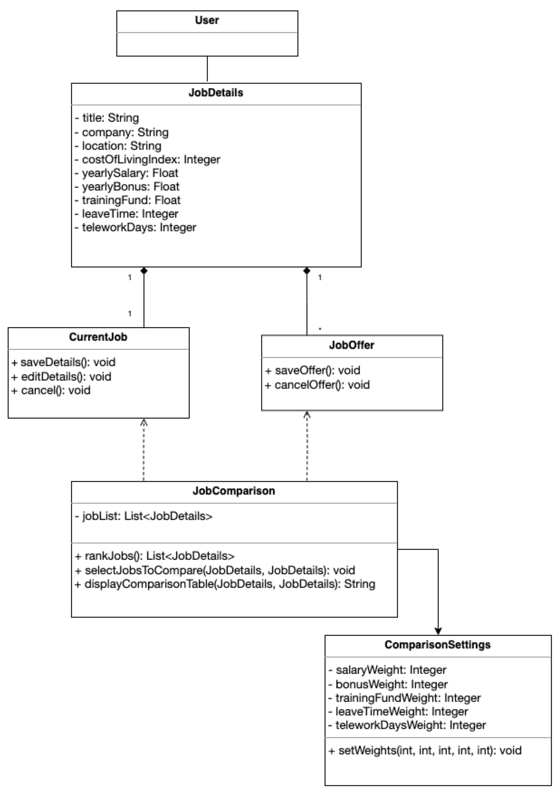

## Design 1 (Karun Kumar)

    

 

**Pros**:
- Contains all the necessary classes.
- Methods are set to public and attributes are set to private.

**Cons**:
- Does not explicitly mention an entry point.
- The associations are not correctly defined which makes the diagram hard to follow
- The following calculated attributes are missing:
    - `Salary Adjusted`
    - `Bonus Adjusted`
- `City` and `State` are combined into one attribute `location`.
- Methods do not provide output type.

## Design 2 (Huimin Zhong)

    

 

**Pros**:
- Contains all required attributes and most classes.
- Relationships are clear and correct.
- 'main()' Method is clearly stated as entry point to the system.
- 'location' is divided into 'city' and 'state' attributes, so it can be easily handled by string type.

**Cons**:
- Attributes in 'Weights' class are public, should change to private.
- 'updatejob()', 'saveJob()', 'deleteJob' and 'updateWeights()' methods are missing.
- Money related attributes and 'leaveTime' attributes are int type, should change to float type, which is closer to real life situation.

## Design 3 (Zihan Wang)

    

 

**Pros**:
- All requirements descriped in the document are met.
- All neccessary classes are created. 

**Cons**:

- Every attribute in each class should be private
- CurrentJob attribute can be combined inside the JobOffer class.

## Design 4 (Yue Cheng Tsang)

    

 

**Pros**:
- The JobDetails class has all the job information needed, and both CurrentJob and JobOffer use this information, ensuring consistency.

**Cons**:
- No navigation after entering Job Offers: The design doesn't show options for what to do after entering a job offer, like adding another offer or comparing offers.
- Save and cancel operations: While there are save and cancel methods, the design doesn't show returning to the main menu after canceling, which is needed.  
- Combining `City` and `State` into one attribute `location`   

## Team Design

    

 

**Commonalities**
- All 4 designs included a base `job` class that holds the details for both Job Offers as well as Current Job which was included in the final design as well.
- Overall structure of all `4` designs is very similar to the decipted team design. There are `4` major classes similar to all the individual designs.
- The attributes and methods within each class in the Team Design are very similar to the ones shown in the individual classes.

**Differences**
- In two design, `job` class was inherited by two other classes `CurrentJob` and `JobOffer`. In the other two designs, this distinction was handled with either a boolean or string variable called `isCurrentJob`. To keep the application structure simple, the later was chosen for the team design.
- Most of the designs except one did not initialize the different weights in the design. The requirements state that the weights should all be equal in the event the user does not set them, therefore the weights in the final design are all initialized to a value of 1.
- Entry point was not explicitly defined in some of the designs. In the Team Design, the `Main` class was created to host the `main()` method, which is the designated entry point for the application.
- Lastly, half of the designs do not indicate the multiplicity between the difference classes, the Team Design includes the different multiplicities between classes.

## Summary
- When working in a team of multiple software engineers, it is important to maintain respect towards all members of the team, no matter how vast the difference in experience and opinion might be.
- When considering design for an application, different people may approach the same design slightly different and all approaches should be critiqued equally.
- Asking questions was a vital part of the discussion for multiple reasons. It allows the designer to explain their thought process but it can also help other team members gain better understanding of concepts that they may not completely understand.
- All critiques should be done in a professional manner. The creator should hold composure and not be defensive about their design desicions. The critic should maintain professional composure during the critique as well and offer criticism in a constructive manner.
