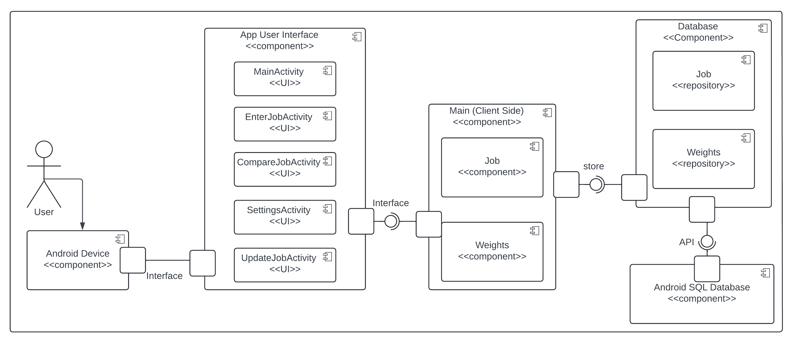
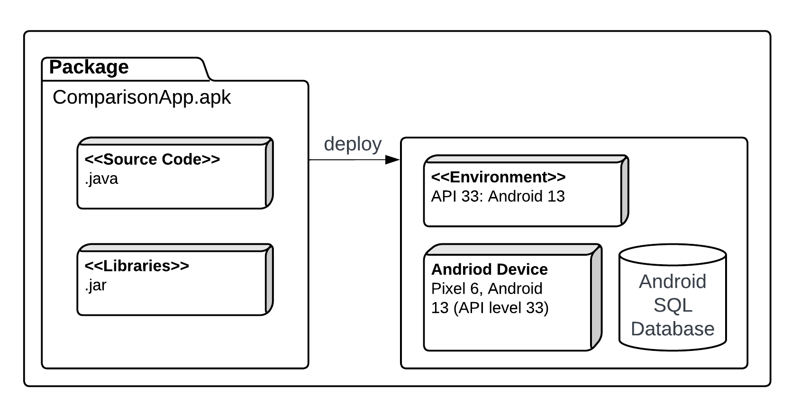
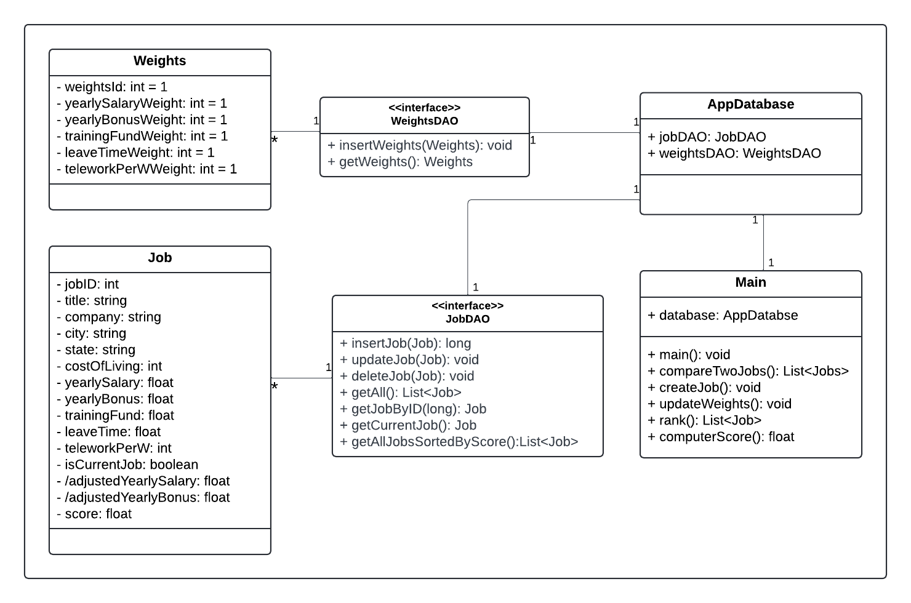
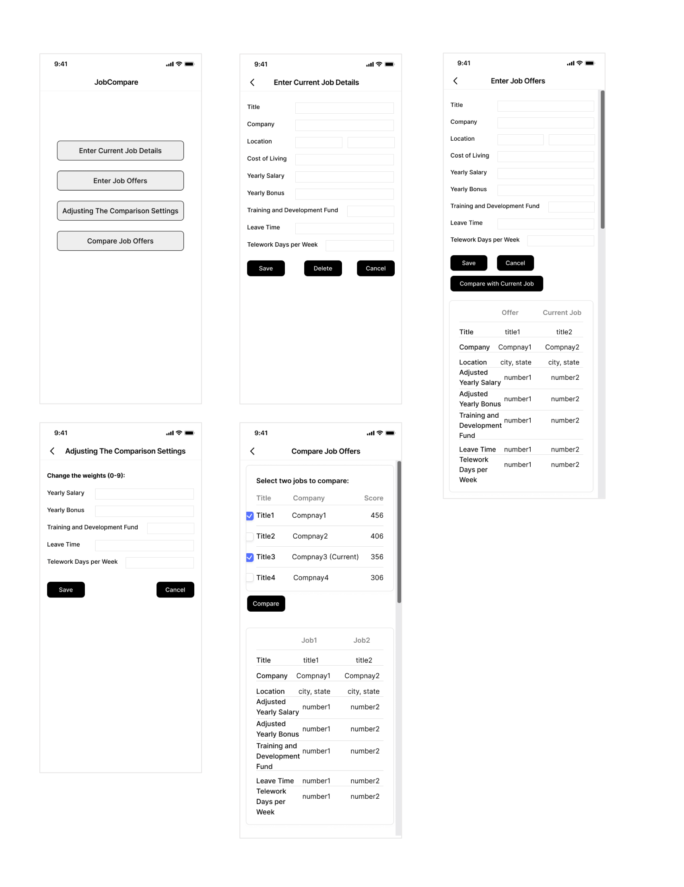
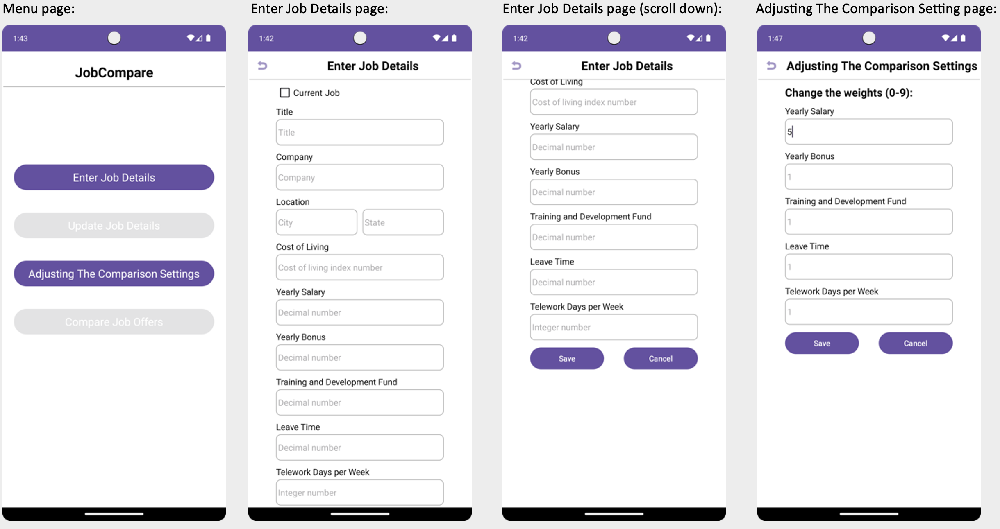
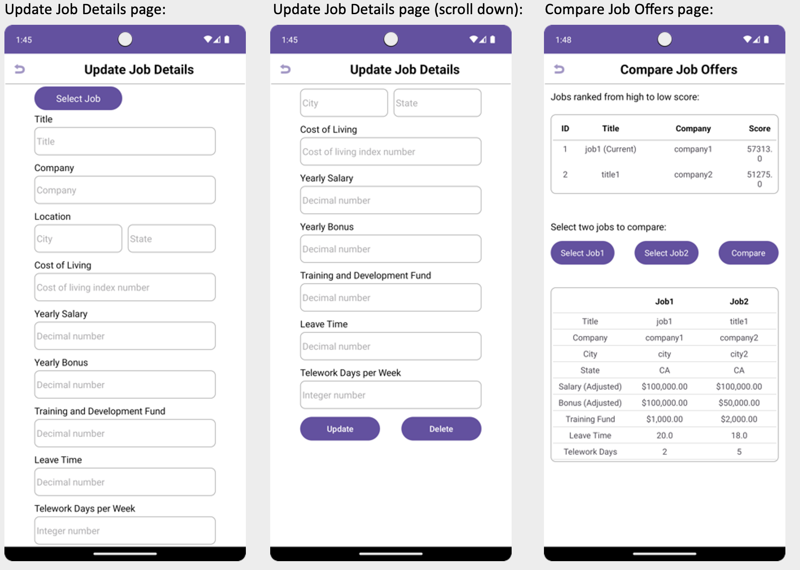

# Design Document -Version 3.0

**Author**: Team051
 
Version 2.0: updated User Interface Design. 
Version 3.0: updated class, component diagram and Architectural Design section.

## 1 Design Considerations

### 1.1 Assumptions

- Users will know how to use this basic job comparison apps.
- The app will run on Android devices.
- Users will enter job details and offers manually.
- The app does not need the internet to work.
- The comparison method will focus on salary, bonuses, and other benefits.
- The app can handle details of 5 job offers (include current job) without slowing down.

### 1.2 Constraints

- We have a fixed timeline to follow to completed the app.
- The app must work with Android 13 and above.
- User data must be stored on the device for privacy and security.
- The app needs to be easy to use.
- The comparison method should be simple and clear.
- Users must input both city and state as the location in job details.
- Users must fill in yearly salary, yearly bonus, cost of living index, adjusted yearly salary, and adjusted yearly bonus, and these must be numbers.
- All user data entered must be saved and remain available even after the app is closed and reopened.

### 1.3 System Environment

- The app will run on Android smart phones and tablets. It should be optimized for different screen sizes and resolutions to ensure a good user experience across different devices.
- The app will be compatible with Android 13 (API 33) and above. This ensures compatibility with modern devices while using the latest features and security updates. 
- We will use Android Studio, the official IDE for Android development. This IDE provides integrated tools for coding, testing, and debugging.
- The app will be developed using Java 17, the primary language for Android development.
- The app must ensure that all user data is securely stored and handled. 
- The development process will include extensive testing using both emulators and real devices. 

## 2 Architectural Design
The following sections display the component level and deployment architechture for this application. It details the high level component architechture with the different layers of interfacing between the components. The deployment architecture reflects the app package and the expected production components of this application. 

### 2.1 Component Diagram

    

 

There are 5 major components for this application:
- Andriod Device
- App User Interface (GUI)
- Client Side Serivce
- Database Service
- Database

The user directely interfaces with App UI via the Andriod Device. The App UI is connected to client side service layer that contains majority of the logic that is required for the app to function. Persistent objects created by the client side service layer will be stored in the Andriod SQL database via the repositories in the database service layer.

### 2.2 Deployment Diagram

    

 

The application will be packaged to deploy onto a device with compatible production environment. This environment is selected to be `Pixel 6, Android 13`, with `API level 33`. The Application package (apk) contains the source code, writen in Java and all supporing libraries (.jar). On the client side, device must also be compatible with the selected version of Andriod SQL database, which will be selected during the development process.

## 3 Low-Level Design

### 3.1 Class Diagram

    

 

## 4 User Interface Design
**D1 user interface design:**

    

 
The user interface contains five screens: 
Main menu, enter current job details, enter job offers, adjusting the comparison settings, compare job offers. 
 
 

**D2 user interface design:**

    

 

    

 
D2 updates: 

- Combined similar functions into a single location to streamline and clean up the app: enter job details for current job and job offers were combined into one "Enter Job Details" screen, a checkbox "Current Job" was added to differentiate the two; compare job offer with current job and compare two jobs were combined, showing at the "Compare Job Offers" screen.
- A new screen "Update Job Details" was implemented to handle the update and delete job functionality.
- Multiple popup menu buttons were added for selecting saved jobs.
