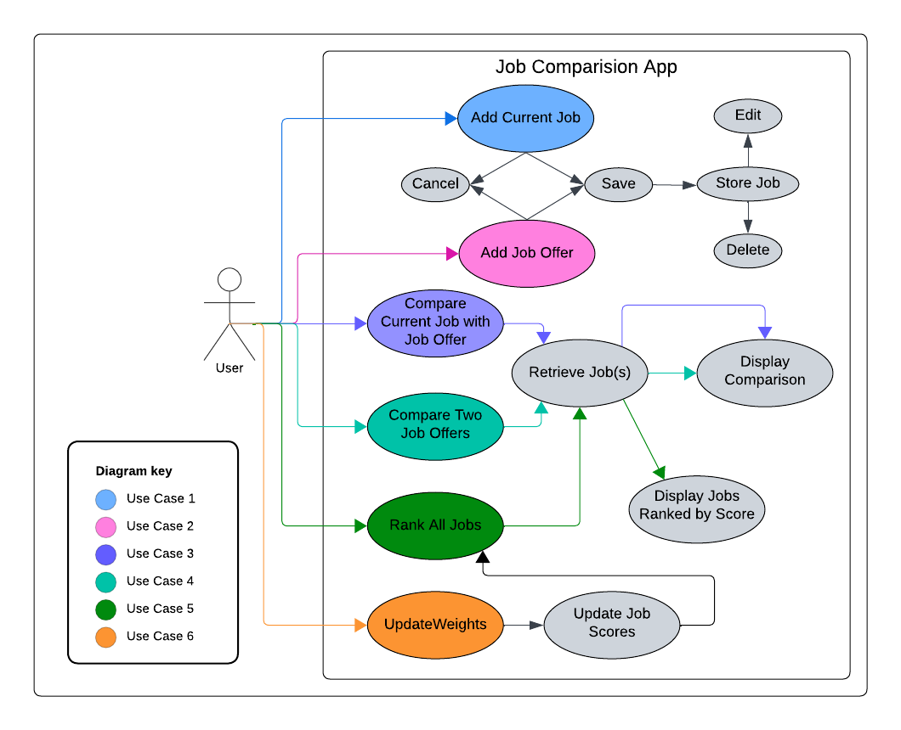

# Use Case Model

**Author**: Team 051
 
Version 2.0: updated Use Case 1-5. 

## 1 Use Case Diagram

    

 

## 2 Use Case Descriptions

### Use Case 1: Adding/Editing Current Job

- *Requirements:* 
    - The user must be able to add their current job details to the application.
    - The user must be able to save, edit or cancel the process of adding their current job.
- *Pre-conditions:*
    - User must get to the `Enter/Update Job Details` page. 
- *Post-conditions:*
    - User current job details are stored in the app database.
    - User current job details are updated in the app database.
- *Scenarios:*
    - User opens the JobCompare6300 App.
    - To enter a new Current Job:
        - User selects the `Enter Job Details` button.
        - User enters all job details and checks the `Current Job` checkbox.
    - To Update existing Current Job:
        - User selects the `Update Job Details` button.
        - User clicks the  `Select Job` button and selects the current job.
        - User updates the required job details
    - User clicks `Save` or `Cancel` to either save to enter the job details into the app database or cancel the process.

### Use Case 2: Adding Job Offer

- *Requirements:* 
    - The user must be able to add new job offer details to the application.
    - The user must be able to save, edit or cancel the process of adding new job offer.
- *Pre-conditions:*
    - User must click to the `Enter/Update Job Details` button.
- *Post-conditions:*
    - A new job offer is stored in the app database.
    - A previous job offer details are updated in the app database.
- *Scenarios:*
    - User opens the JobCompare6300 App.
    - To enter a new Job offer:
        - User selects the `Enter Job Details` button.
        - User enters all job details and does not check the `Current Job` checkbox.
    - To Update existing Current Job:
        - User selects the `Update Job Details` button.
        - User clicks the  `Select Job` button and selects the job offer to be edited.
        - User updates the required job details
    - User clicks `Save` or `Cancel` to either save to enter the job details into the app database or cancel the process.
### Use Case 3/4: Comparing Current Job with Job Offer or Two Job Offers

- *Requirements:* 
    - User must be able to compare existing job offers with current job.
    - User must be able to compare any two exisiting job offers.
    - User must be shown all job details in a table format for each selected job.
- *Pre-conditions:*
    - User must select the `Compare Job Offers` button to beign comparison process.
- *Post-conditions:*
    - User is transported to the `Job Offers` page with comparison table displayed at the bottom.
- *Scenarios:*
    - User opens the `Job Comparison App` on their Android smartphone.
    - User navigates to the `Compare Jobs` button on the `Job Offers` page.
    - If the user wants to compare their current job with a job offer:
        - User selects the `Current Job` and a `Job Offer` from the list of existing offers.
    - If the user wants to compare two job offers:
        - User selects two job offers from the list of existing offers.
    - User clicks the `Compare` button.
    - The app displays a comparison table at the bottom of the `Job Offers` page, showing details of the two selected job offers side by side.

### Use Case 5: Rank all Jobs

- *Requirements:* 
    - App must display a list of all existing job offers and the current job, sorted by the given scoring method.
- *Pre-conditions:*
    - Current Job details and/or at least one job offer must be previously entered into the system.
- *Post-conditions:*
    - Job table is displayed on the `Compare Job Offers` page on the App.
- *Scenarios:*
    - User enters their current job details.
    - Optionally, User enters at least one job offer into the system.
    - User navigates to the `Compare Job Offers` page.
    - App displays the ranked list of jobs.

### Use Case 6: Updating Comparison Settings

- *Requirements:* 
    - The user must be able to update the settings used for comparing job.
    - The user must be able to save or cancel the process of updating the comparison settings.
- *Pre-conditions:*
    - User must click the Edit Comparison Settings button on the Job Offers page to begin the updating process.
- *Post-conditions:*
    - The updated comparison settings are stored in the app database.
    - The ranked list of jobs is updated based on the new comparison settings.
- *Scenarios:*
    - User opens the `Job Comparison App` on their Android smartphone.
    - User clicks the `Adjust The Comparison Settings` button.
    - User is presented with a page where they can update comparison settings aka the weights.
    - User makes the desired changes to the comparison settings.
    - User either selects `Save` to apply the new settings or `Cancel` to discard changes.
    - App saves the updated comparison settings and returns the user to the `Main` page.
    - App updates the ranked list of jobs based on the new comparison settings.